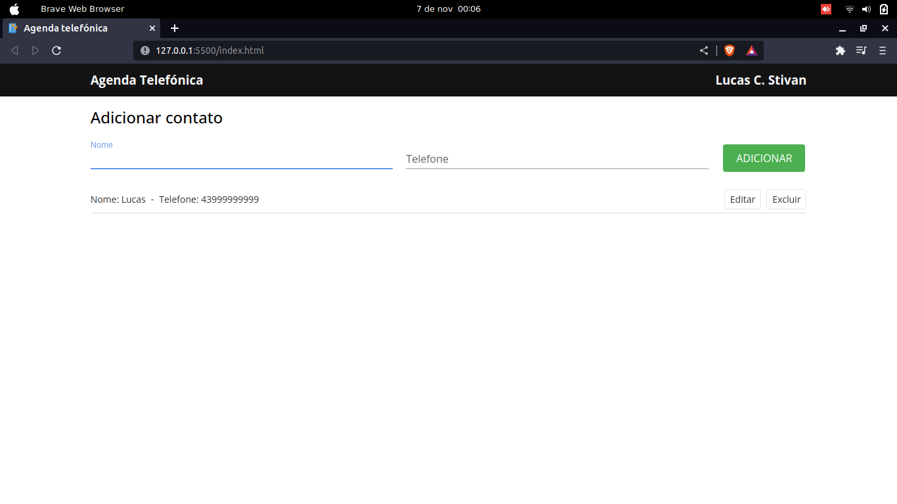

# Agenda telefónica

## Descrição

Uma aplicação front-end feita com HTML, CSS e JavaScript que permite ao usuário criar uma agenda telefônica com nome e telefone.

## Funcionalidades

- Adicionar contato
- Editar contato
- Excluir contato
- Listagem contatos

